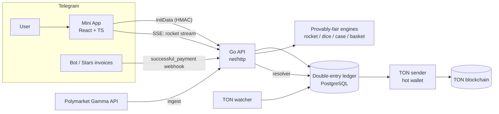

<div align="center">

<h1>Predict Market</h1>

**A Telegram Mini App prediction market on real-world events (Polymarket odds, auto-settled) plus four provably-fair instant games — full-stack React + Go, with a live in-browser demo.**

**▶️ Live demo:** https://chigerartem.github.io/predict-market/

<sub>The hosted demo runs entirely client-side on mock data (no backend) — full stack details below.</sub>

[](https://chigerartem.github.io/predict-market/)
[](https://github.com/chigerartem/predict-market/actions/workflows/ci.yml)
[](https://go.dev/)
[](https://react.dev/)
[](https://www.typescriptlang.org/)
[](https://www.postgresql.org/)
[](https://tailwindcss.com/)
[](https://ton.org/)
[](LICENSE)

</div>

---

## What is this

**Predict Market** is a Telegram Mini App where users bet — in **TON** — on real-world
events and play instant casino games. It opens from a Telegram bot, authenticates with
Telegram Mini App `initData`, and runs two things side by side:

- **A prediction market.** Open markets are mirrored from **Polymarket** (sports, crypto,
  politics, economy, …) and shown with the **same odds, no house markup**. A bet moves the
  stake into escrow against the house; a resolver settles each market automatically from
  the public Polymarket result. One active bet per event — no hedging, no doubling down.
- **Four provably-fair games.** **Rocket** (a real-time crash game over SSE), **Dice**,
  **Cases** (CS:GO-style), and **Basketball** — each instant, each verifiable from a
  committed server seed.

The money layer is a **double-entry ledger** in integer nano-TON: every deposit, bet,
payout and withdrawal is a balanced transaction, so balances are always reconcilable and
the house can't pay out what it can't cover. Deposits are **TON** (via TON Connect) or
**Telegram Stars**; TON withdrawals are sent on-chain from a hot wallet by a background
worker.

The frontend is a **React + TypeScript** Mini App; the backend is a dependency-light **Go**
service (`net/http` + `pgx` + PostgreSQL). The whole thing is wired together with Docker
Compose behind nginx.

## Demo

**▶️ https://chigerartem.github.io/predict-market/**

The hosted demo is the exact same React app built with `--mode demo`: every API call is
served from an in-browser mock store ([`web/src/demo.ts`](web/src/demo.ts)) instead of the
Go backend, so it needs no server and stays fully interactive — browse the market feed,
place bets, play all four games, top up and withdraw against a mock balance. In production
the app runs inside Telegram and talks to the Go API instead.

## Features

- 🎯 **Prediction market on Polymarket odds** — open markets mirrored by category, shown with the **same multipliers as Polymarket** (no vig); bets settle automatically from public results.
- 🚫 **One bet per event** — a row-locked check enforces a single active bet per market per user (no two-sided hedging, no doubling), surfaced in the feed so you can't even try.
- 🚀 **Rocket (crash)** — a live multiplier streamed over **Server-Sent Events**; cash out before it busts. Provably-fair crash point from a committed seed.
- 🎲 **Dice · 🟪 Cases · 🏀 Basketball** — instant single-player games with their own odds/RTP and animated outcomes (Lottie), each verifiable.
- 🔐 **Provably fair** — every game outcome derives from a server seed committed (hashed) before play and revealed on rotation, so results can't be altered after the fact.
- 💎 **TON + Stars deposits** — top up from any wallet via **TON Connect**, or pay with **Telegram Stars** (invoice → credited on the payment webhook at the live rate).
- 🏦 **On-chain TON withdrawals** — a request debits the balance atomically and a background sender broadcasts the transfer from the house hot wallet (idempotent, fail-safe).
- 🧾 **Double-entry ledger** — escrow + liability-reserve + treasury accounts in integer nano-TON; every movement is a balanced, idempotent transaction with a non-negative balance check that can't be raced.
- 🛡️ **Telegram-native auth** — every request is authenticated by validating Mini App `initData` (HMAC-SHA256) against the bot token; no passwords.
- ⚡ **Eager, instant UI** — all tabs mount up front and Lottie animations are prefetched, so navigation is instant and games start with no load spinner.

## How it works



- **Markets:** a background ingester pulls top Polymarket markets (by 24h volume), stores them with their outcomes/odds, and an independent resolver settles each one from the public result.
- **Betting:** `PlaceBet` moves the stake to escrow and reserves the house's potential payout in **one transaction**, rejecting the bet if the user or the house can't cover it — and enforcing the one-active-bet-per-market rule under a row lock.
- **Games:** each game commits to a hashed server seed, then derives outcomes deterministically per incrementing nonce; rotating the seed reveals the old one for verification.
- **Money in/out:** Stars credit on the Bot API payment webhook; TON deposits are matched by a per-user memo by an on-chain watcher; withdrawals are queued and broadcast by a sender worker.

## Tech stack

| Layer        | Tech |
|--------------|------|
| Mini App     | React 18, TypeScript (strict), Vite 6, Tailwind CSS 3, lottie-web, TON Connect UI, a tiny custom i18n |
| API          | Go 1.26, `net/http` (method routing), `pgx` v5 |
| Data         | PostgreSQL 16, embedded SQL migrations (advisory-lock migrator), double-entry ledger |
| Real-time    | Server-Sent Events (rocket round stream) |
| Payments     | TON (`tonutils-go`, TON Connect), Telegram Stars (Bot API invoices) |
| Auth         | Telegram Mini App `initData` (HMAC-SHA256) |
| Ops          | Docker Compose, nginx (SPA + gzip + immutable asset cache), GitHub Actions (CI + Pages) |

## Project structure

```
.
├── cmd/api/            # Go entrypoint (HTTP server + workers wiring)
├── internal/
│   ├── httpapi/        # routes + handlers
│   ├── ledger/         # double-entry ledger (accounts, postings)
│   ├── betting/        # place / settle / void bets against the house
│   ├── markets/        # market + outcome storage
│   ├── polymarket/     # ingest + resolver
│   ├── deposits/       # Stars + TON crediting
│   ├── withdrawals/    # TON payout queue
│   ├── ton/            # on-chain watcher + sender
│   ├── tg/             # Telegram Bot API client
│   └── rocket | dice | casegame | basket/   # provably-fair game engines
├── migrations/         # embedded SQL migrations
├── web/                # React + TS Mini App (src/demo.ts = in-browser mock)
├── Dockerfile.api
└── docker-compose.yml
```

## Quick start

### 1. Just look — the live demo
**https://chigerartem.github.io/predict-market/** — no setup, runs on mock data in the browser.

### 2. Run the demo locally
```bash
cd web
npm install
npm run dev -- --mode demo      # http://localhost:5173/predict-market/
```

### 3. Run the backend (Go API + Postgres)
```bash
cp .env.example .env             # set DATABASE_URL, TG_BOT_TOKEN, …
docker compose up -d             # Postgres on :55432
go run ./cmd/api                 # API on :8000 (DEV_USER_ID=1 to skip Telegram auth)
```

### 4. Run the frontend against that API
```bash
cd web
npm install
VITE_API_BASE=http://localhost:8000 npm run dev
```

## Configuration

Backend config is read from the environment (see [`.env.example`](.env.example)) — bot
token, `DATABASE_URL`, the Stars→TON rate buffer, the TON deposit address and the
(optional) hot-wallet mnemonic that enables withdrawals. The frontend takes `VITE_API_BASE`
at build time; `--mode demo` flips it to the in-browser mock and serves under
`/predict-market/`.

## Provably fair

Each game publishes a **SHA-256 hash of a server seed** before you play. Outcomes are
derived deterministically from the server seed, your client seed and an incrementing
nonce, so a single play can't be cherry-picked. Rotating the seed **reveals the previous
seed**, so every past outcome under it can be recomputed and checked. Market bets don't
need this — they settle from public Polymarket results.

## Tests & CI

- **Go:** `go test ./...` covers the ledger invariants, bet lifecycle (win / lose / void, the one-bet rule), withdrawals and each game's fairness/RTP math. `go vet` + `gofmt` are clean.
- **Web:** `npm run typecheck` (strict TS) + `npm run build`.
- **CI:** GitHub Actions runs both on every push/PR; a separate workflow builds the demo and deploys it to GitHub Pages.

## License

All rights reserved — published for portfolio review only. See [LICENSE](LICENSE).
